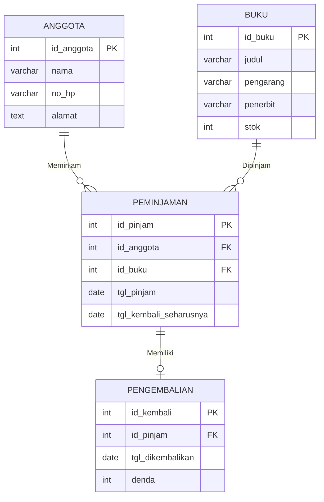

# Laporan UAS Basis Data - Sistem Informasi Perpustakaan

Repositori ini dibuat untuk memenuhi tugas Ujian Akhir Semester (UAS) mata kuliah Basis Data. Projek ini mencakup perancangan, normalisasi, implementasi DDL/DML, serta pembuatan aplikasi CRUD sederhana menggunakan Python dan PHP.

---

## 1. Topik Pilihan
* **a. Sistem Informasi Perpustakaan**

---

## 2. Proses Bisnis & Modul Sistem

### Proses Bisnis:
1. **Pendaftaran Anggota:** Pengunjung mendaftar untuk menjadi anggota perpustakaan agar mendapatkan hak akses peminjaman.
2. **Pencarian & Peminjaman:** Anggota mencari buku yang tersedia melalui katalog. Petugas memproses peminjaman dengan mencatat tanggal pinjam dan batas waktu pengembalian.
3. **Pengembalian & Denda:** Anggota mengembalikan buku kepada petugas. Jika pengembalian melewati batas waktu yang ditentukan, sistem secara otomatis menghitung denda keterlambatan yang harus dibayar.

### Modul Sistem:
* **Modul Keanggotaan:** Mengelola manajemen data master anggota.
* **Modul Katalog Buku:** Mengelola manajemen data master buku (judul, pengarang, penerbit, stok).
* **Modul Sirkulasi:** Mengelola transaksi peminjaman, pengembalian, dan perhitungan denda.

---

## 3. Aktor yang Terlibat
* **Modul Keanggotaan:** Petugas Perpustakaan (mengelola data) dan Anggota (mendaftar/mengubah profil).
* **Modul Katalog Buku:** Petugas Perpustakaan (menambah/memperbarui buku) dan Anggota (mencari buku).
* **Modul Sirkulasi:** Petugas Perpustakaan (validasi pinjam/kembali dan menerima denda) dan Anggota (melakukan transaksi).

---

### 4 & 5. Desain Entity Relationship Diagram (ERD) & Kardinalitas

### Visualisasi ERD (Crow's Foot Notation):

### Penentuan Kardinalitas Relasi:
* **Relasi Peminjaman Anggota (1:M):** Satu kode `id_anggota` yang sama dapat muncul berkali-kali di dalam tabel peminjaman karena satu anggota dapat melakukan banyak transaksi peminjaman yang berbeda.
* **Relasi Peminjaman Buku (1:M):** Satu kode `id_buku` yang sama dapat muncul berkali-kali di dalam tabel peminjaman karena satu buku dapat dipinjam oleh banyak anggota yang berbeda.
* **Relasi Pengembalian (1:1):** Satu kode `id_pinjam` hanya dapat muncul satu kali di dalam tabel pengembalian karena satu transaksi peminjaman hanya memiliki satu kali proses pengembalian.

---

## 6. Proses Normalisasi Database

* **Unnormalized Form (UNF):** Menggabungkan semua atribut kotor ke dalam satu format:
  `[id_anggota, nama, no_hp, alamat, id_buku, judul, pengarang, penerbit, stok, id_pinjam, tgl_pinjam, tgl_kembali_seharusnya, id_kembali, tgl_dikembalikan, denda]`
* **First Normal Form (1NF):** Menghilangkan repeating groups dan memastikan semua nilai bersifat atomic:
  `[id_pinjam, id_anggota, nama, no_hp, alamat, id_buku, judul, pengarang, penerbit, stok, tgl_pinjam, tgl_kembali_seharusnya, id_kembali, tgl_dikembalikan, denda]`
* **Second Normal Form (2NF):** Menghilangkan ketergantungan parsial dan memecah tabel berdasarkan Primary Key masing-masing:
  * **Tabel Anggota:** `id_anggota` (PK), `nama`, `no_hp`, `alamat`.
  * **Tabel Buku:** `id_buku` (PK), `judul`, `pengarang`, `penerbit`, `stok`.
  * **Tabel Peminjaman:** `id_pinjam` (PK), `id_anggota` (FK), `id_buku` (FK), `tgl_pinjam`, `tgl_kembali_seharusnya`.
  * **Tabel Pengembalian:** `id_kembali` (PK), `id_pinjam` (FK), `tgl_dikembalikan`, `denda`.
* **Third Normal Form (3NF):** Menghilangkan ketergantungan transitif. Karena seluruh atribut non-key sudah bergantung penuh pada primary key masing-masing tabel di tahap 2NF, maka struktur ini telah memenuhi syarat 3NF.

---

## 7. Implementasi DDL (MySQL/MariaDB)

```sql
CREATE DATABASE perpustakaan;
USE perpustakaan;

CREATE TABLE anggota (
    id_anggota INT AUTO_INCREMENT PRIMARY KEY,
    nama VARCHAR(100),
    no_hp VARCHAR(15),
    alamat TEXT
);

CREATE TABLE buku (
    id_buku INT AUTO_INCREMENT PRIMARY KEY,
    judul VARCHAR(150),
    pengarang VARCHAR(100),
    penerbit VARCHAR(100),
    stok INT
);

CREATE TABLE peminjaman (
    id_pinjam INT AUTO_INCREMENT PRIMARY KEY,
    id_anggota INT,
    id_buku INT,
    tgl_pinjam DATE,
    tgl_kembali_seharusnya DATE,
    FOREIGN KEY (id_anggota) REFERENCES anggota(id_anggota),
    FOREIGN KEY (id_buku) REFERENCES buku(id_buku)
);

CREATE TABLE pengembalian (
    id_kembali INT AUTO_INCREMENT PRIMARY KEY,
    id_pinjam INT,
    tgl_dikembalikan DATE,
    denda INT DEFAULT 0,
    FOREIGN KEY (id_pinjam) REFERENCES peminjaman(id_pinjam)
);

-- Insert Data awal
INSERT INTO anggota (nama, no_hp, alamat) VALUES ('Rian', '08123456789', 'Surabaya');
INSERT INTO buku (judul, pengarang, penerbit, stok) VALUES ('Basis Data', 'Indrajani', 'Elex Media', 5);

-- Update Data (Pengurangan stok saat dipinjam)
UPDATE buku SET stok = stok - 1 WHERE id_buku = 1;

-- Delete Data
DELETE FROM anggota WHERE id_anggota = 1;

import mysql.connector

# Koneksi ke database MySQL
db = mysql.connector.connect(
    host="localhost",
    user="root",
    password="Ganjarpantek123",
    database="perpustakaan"
)
cursor = db.cursor()

# 1. CREATE
cursor.execute("INSERT INTO anggota (nama, no_hp, alamat) VALUES (%s, %s, %s)", ('Siti', '0857112233', 'Sidoarjo'))
db.commit()

# 2. READ
cursor.execute("SELECT * FROM anggota")
for row in cursor.fetchall():
    print(row)

# 3. UPDATE
cursor.execute("UPDATE anggota SET nama = %s WHERE id_anggota = %s", ('Siti Aminah', 2))
db.commit()

# 4. DELETE
cursor.execute("DELETE FROM anggota WHERE id_anggota = %s", (2,))
db.commit()

<?php
$conn = new mysqli("localhost", "root", "Ganjarpantek123", "perpustakaan");

if ($conn->connect_error) {
    die("Koneksi gagal: " . $conn->connect_error);
}

// 1. CREATE
$conn->query("INSERT INTO buku (judul, pengarang, penerbit, stok) VALUES ('Struktur Data', 'Sanjaya', 'Informatika', 3)");

// 2. READ
$result = $conn->query("SELECT * FROM buku");
while($row = $result->fetch_assoc()) { 
    print_r($row); 
    echo "<br>";
}

// 3. UPDATE
$conn->query("UPDATE buku SET stok = 5 WHERE id_buku = 2");

// 4. DELETE
// $conn->query("DELETE FROM buku WHERE id_buku = 2");
?>
